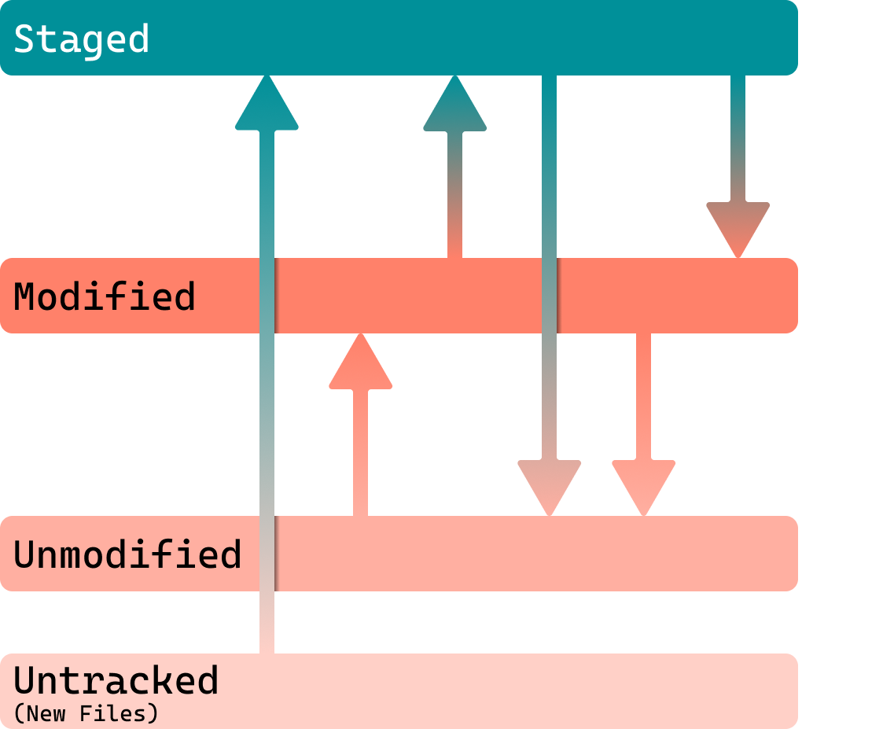

import Aside from '../../components/Aside.astro';

## Git

According to the git [README](https://git.kernel.org/pub/scm/git/git.git/tree/README.md?h=main), git is:

- a mispronunciation of 'get'
- Dictionary definition: Stupid, Contemptible and Despicable, Simple
- **g**lobal **i**nformation **t**racker
- **g**oddamn **i**diotic **t**ruckload of shit

<a target="_blank" href="https://www.xkcd.com/1597/">XKCD 1597</a>

Git is a Distributed  Version Control System. Meaning that you do not need a server to run it like Perforce. It was made in 2005 for Linux after BitKeeper (the VCS they used at the time) revoked their free license. It has since grown to become the de facto standard VCS.

It works by taking snapshots of the entire file system on each commit.

## Table of Contents

- [Terminology](#terminology)
- [GitHub](#github)
- [Using Git](#using-git)
  - [CLI](#command-line-interface-cli)
  - [CLI w/ Oh-My-Posh](#oh-my-posh)
  - [GitHub Desktop](#github-desktop)
  - [Fork](#fork)
  - [Others](#others)
- [Git Structure](#git-structure)
- [File Lifecycle](#file-lifecycle)
- [Commands](#commands)
  - [Status](#status)
  - [Clone](#clone)
  - [Pull](#pull)
  - [Fetch](#fetch)
  - [Add](#add)
  - [Restore](#restore)
  - [Commit](#commit)
  - [Push](#push)
  - [Branch](#branch)
    - [Syncing](#syncing)
  - [Switch](#switch)
  - [Merge](#merge)
    - [Fast Forward](#fast-forward)
    - [Three-Way Merge](#three-way-merge)
    - [Rebase](#rebase)
    - [Squash](#squash)
  - [Stash](#stash)
- [Oh I fucked up](#oh-i-fucked-up)
  - [Reset](#reset)
  - [Undoing a merge](#undoing-a-merge)
- [Misc](#misc)
  - [Git LFS](#git-lfs)
  - [Conventional/Semantic Commits](#conventionalsemantic-commits)
  - [GitHub CLI](#github-cli)
- [Resources](#resources)

## Terminology

As with any new software/system, there is terminology specific to the tool:

- Repository (Referred to as "Repo")
  - Place which holds the files and version control metadata
  - Anything outside of the Repo is not tracked
  - All the relevant data is saved in a `.git` folder in the root
- Remote Origin
  - The server which is the main source of truth. Normally is the GitHub server but can be local servers.
  - Anytime you see 'origin' think server/cloud. Branches on the server will show up as `origin/branch_name` on your machine.
- Local Repository
  - The repository on your computer.
  - Nearly every operation is local
    - Only non local operation are:
      - `push`
      - `pull`
      - `fetch`
      - `clone`
- Commit
  - A snapshot of the files you have changed
- Upstream/Downstream
  - Where you are relative to changes in the repo
  - You can commit something upstream which adds onto the repo
  - You can be downstream if you are behind the repo

## GitHub

Often when discussing git to people it invariably gets mixed up with GitHub so I have to include this difference out early.

GitHub is place to upload code, it is what YouTube is to videos. If you have any open-sourced project it is the best place to host the code. Many projects that have millions of users around the world use projects hosted on GitHub such as React, .NET and VSCode. It also has many companies that release their tooling and also individual people who show off their own projects. This is not a GitHub guide though so for our purposes, GitHub is basically a cloud server that only accepts git repositories.

It is **not** git.

## Using git

### Command Line Interface (CLI)

git is a command line tool so this is its native interaction method.

Command Lines can be scary but all you need to start really is `cd` for change directory (`cd Assets` to go into a folder called "Assets" or `cd ..` to go up a folder) and `ls` to list the current files and directories in a folder.

#### oh-my-posh

I use something called oh-my-posh (mac equivalent would be oh-my-zsh + powerlevel10k) which shows some more information about the current git repository like branch, modified files, staged files, commits to push and commits to pull.

It is highly customisable with many premade themes that exist and the capability to customise your own.

### GitHub desktop

<Aside type="caution" title="This is not advice">
I do not use GUIs so I cannot truly say how good they are. I have learnt how GitHub Desktop and Fork work to be able to help people but I do not personally use them. I use the git cli with oh-my-posh
</Aside>

[GitHub Desktop Website](https://github.com/apps/desktop)

This is one developed by GitHub desktop. Seems to do the job well enough.

### Fork

[Fork Website](https://git-fork.com/)

This one seems to have a lot of support around it as well and people find it easy to use.

### Others

- [Sourcetree](https://www.sourcetreeapp.com/)
- [Sublime Merge](https://www.sublimemerge.com/)
- [GitKraken](https://www.gitkraken.com/)
- [Tower](https://www.git-tower.com/windows)
- [SmartGit](https://www.syntevo.com/smartgit/)
- [Anchorpoint](https://www.anchorpoint.app/features/git-for-artists)
- [VSCode](https://code.visualstudio.com/docs/sourcecontrol/overview)
- [JetBrains IDE](https://www.jetbrains.com/help/idea/manage-branches.html)
- [Magit](https://magit.vc/)
- [LazyGit](https://github.com/jesseduffield/lazygit)
- [Git Extensions](https://gitextensions.github.io/)
- [And more!](https://git-scm.com/downloads/guis)

## Git Structure

### Working Areas

There are 4 areas that are important to understand with where your files are where.

- Working
  - Where you are modifying files and such.
- Staging
  - Where you have selected the files you want to commit.
  - Think of Staging as a completely separate place to the Working area.
    - Changes in the Working area will **NOT** appear in the Staging area.
- Local
  - The repo on your machine
- Remote
  - The repo on the server

### File Lifecycle

Files have 4 different stages they can be in (well 5 if you count merge conflict).

- Untracked
  - Files that git has no history on and will want to track.
- Unmodified
  - Files that have not been modified. This will be most of your files.
- Modified
  - Files that have been modified
- Staged
  - Files about to be committed.

Once a file has been committed it falls back to being unmodified.

## Commands

### Status

This is the most useful command. Is is so useful that the purpose of git GUIs is to show this information in a clearer manner.

`git status`

It displays:

- Current branch/commit
- Files in staging
- Modified files
- Untracked files
- How far ahead/behind you are from the remote repo

### Clone

It's how you get repositories in the first place. Useful to know if you need to start from scratch because you've messed up your current repo.

`git clone <URL>`
`git clone <URL> <FOLDER>`

### Pull

How to get updated files from the remote repo.

`gil pull`

### Fetch

This will look at the remote and see what the latest commits and branches are. Some GUIs and tools will run this intermittently so you can see when there are new commits to pull.

`git fetch`

### Add

Adds the selected files to staging.
Staging is the files you want to commit and push. Some git GUIs omit this step and will commit the files you have selected.

`git add .` to add all modified files
`git add <FILE>` e.g. `git add Assets/Project/Scripts/SomeSpecificFile.cs`

### Restore

To undo a file you have added to staging.

`git restore <FILE>`
`git restore --staged <FILE>`

<Aside type="caution" title="Old Guides">
There might be some old guides that talk about using `git reset` to bring files back from staging. This is **old** as of v2.23.0 (2019-08-03) and you should use `git restore`.
</Aside>

### Commit

Submits your changes with a message.

-m appends the message to the commit (or else it'll open a text editor for you to write)

`git commit -m "fix: message"`

You can skip staging files by adding the `-a` flag to the command. E.g.
`git commit -am "feat: main menu"`

### Push

Push uploads it to the server. All commits you have not pushed will be pushed to remote/origin

`git push`

### Branch

A branch is a splitting of the tree, hence branch. (Branching of a whole repository is called a fork)
Branches are extremely useful as it allows you to make experiments, work on features and save milestones without affecting the main branch. If you have files staged, modified or untracked, they will carry over to the new branch.

`git branch <BRANCH_NAME>`

To delete:
`git branch -d <BRANCH_NAME>`

To view branches:
`git branch`

#### Syncing

If you want to synch your branch you can merge into your branch by doing: `git merge <BRANCH_NAME>`

### Switch

Allows you to switch branches.

`git switch <BRANCH_NAME>`

### Merge

If you are working on a branch you will eventually need to merge it back into the main branch. There are a few "merge strategies" to think about though.

#### Fast Forward

If the branch you are merging to has had no changes since you created the branch, git will just move the branch to the current commit and no real merging will happen.

#### Three-way merge

If someone has made another commit on the branch you want to merge to git will do a three-way merge. It will create a new snapshot of the two branches merged and commit that. This new commit is legitimately special as it contains references to both branches.

#### Rebase

Takes all of your commits off the tree, pulls all of the commits and then places each commit one by one.

<Aside type="caution" title="Only do on local">
This one is slightly dangerous as it does rewrite your git history so it should only be used locally if you have **not pushed**. This operation should really only be done on local branches.
</Aside>

I use it when I make a commit on main and then someone else commits before I had a chance to push.

If merging from another branch
`git merge <BRANCH_NAME> --rebase`

If on the same branch
`git pull --rebase`

#### Squash

Combines all the commits from the branch and makes it into a single commit. Can be useful to have a clean repository.

#### Merge Conflicts

If you have conflicts it is best to view them in some viewer, whether that is in the GUI itself, P4Merge or in a text editor. Use your best judgement when trying to merge as each merge can be slightly different.

### Stash

A way you can save files without committing them. Some operations require a clean working directory so doing this you can save your files, do the operation and then unstash them.

To stash your files you can run:
`git stash`

To unstash your files you can run:
`git stash pop`

## Oh I fucked up

### Reset

The reset command is how we can undo a commit. Reset will change where the commit the branch also looks at rather than just what you're looking at.

To undo the last commit run:
`git reset --soft HEAD~`

A few things to go over for understanding.

- `--soft`
  - Means it will only undo the command of `git commit`
  - There are 2 other options
    - `--mixed` will undo all the `git add` commands
    - `--hard` will undo the working directory which **deletes history**.
- `HEAD`
  - The last commit on the branch
- `~`
  - The previous commit (also known as the parent)

Basically the command is telling git to go to the last commit, go to the one before it, and any commits in front of it to be put back into the staging area.

### Undoing a Merge

You can use the command `git merge --abort` to undo a merge commit.

## Misc

### Git LFS

[Git LFS Website](https://git-lfs.com/)

Git Large File Storage is a solution to storing larger binary files such as images and compressed data that you need to store in a git repo. The reason this is a separate thing is that when you clone or pull a repo, you download every version of that file. When code is predominantly text files, this is not a big deal, but if you are downloading potentially gigabyte's of files, it can take a while.

Git LFS is a plugin that then changes where designated file extensions are saved and replaces the files in the git repo to just a file that points to the real location. Only the files you need specifically at that point in time is then downloaded.

To designate a file use the command:
`git lfs track "*.FILETYPE"`
E.g. `git lfs track "*.psd"` for Photoshop Files.

<Aside type="note" title="Add .gitattributes">
If this is the first file being uploaded to Git LFS make sure to also add the `.gitattributes` file if it shows up.
</Aside>

### Conventional/Semantic Commits

Having a particular format to write commits can be useful. I try to use a method called Semantic Commits which has a predefined title and then a short message about the commit.

E.g. "*fix: opening inventory no longer crashes*" or "*feat: added main menu*"

Allows others to easily read the commit history and know what got changed.

[Semantic Commit Messages Gist by Josh Buchea](https://gist.github.com/joshbuchea/6f47e86d2510bce28f8e7f42ae84c716)
[Conventional Commits](https://www.conventionalcommits.org/en/v1.0.0/)
[Git Semantic Commit Messages by Ryan W](https://callmeryan.medium.com/semantic-commit-messages-bcd60f75de1f)
[Semantic Commit Messages by Sparkbox](https://sparkbox.com/foundry/semantic_commit_messages)

You don't have to do it but I believe it helps.

### GitHub CLI

I use the GitHub cli to clone and to authenticate myself with GitHub. It can be useful if you clone a lot of GitHub repos because instead of typing needing to type the GitHub url you can just type the repo name.

## Resources

[The Git Parable](https://tom.preston-werner.com/2009/05/19/the-git-parable.html)
[Pro Git](https://www.git-scm.com/book/en/v2)
[Interactive Git Branching](https://learngitbranching.js.org/)
