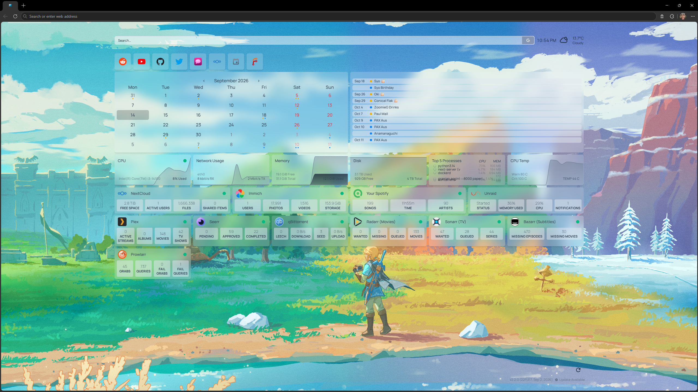

Recently found [homepage](https://gethomepage.dev/) and found it's the first dashboard that I can actually use and was simple to setup. I tried using grafana and stuff but that shit feels like operating a nuclear submarine when I just want to see some server stats.



2560x1440p

Background: \[四季\] by 唏嘘的星辰. [Pixiv Source](https://www.pixiv.net/en/artworks/105587613).

This is running on my local Unraid server.

## Sections

### Header

- Google search
- Time and weather
  - Would be cool if I could click on the weather and it takes me to [BOM](https://www.bom.gov.au/)
  - Having a forecast widget would be nice as well
  - Currently I use Open-Meteo but would be nice to set it up with our government provided weather service.

### Bookmarks

- Reddit
- YouTube
- GitHub
- Twitter
- T3.chat
- NextCloud
- NextCloud Calendar
- Local ForgeJo

### Calendar

I am really bad with calendars because I just never look at them. This makes sure whenever I open my browser it's the first thing I see. Has really calmed a lot of nerves around when things are. The list items on the right I deleted the text of because privacy. Something missing is the ability to make an event, currently have to open up the actual calendar to do that. I would also like to put some kind of task management here as well for ongoing projects through something like [NextCloud's Deck](https://apps.nextcloud.com/apps/deck). I would then like it to be like a 1-2-1 layout, where the calendar is 2 wide in the middle compared to the outer two but I think currently homepage only supports equal width columns.

### Server Stats

Pretty basic CPU, RAM, Network, Processes, Temp and Storage graphs. Since it only loads the data in at that moment I do find the graphs a touch useless, might have to hook into grafana/prometheus. I also want the disk one to actually be the total storage on my server but I have had to settle for a single drive.

### Self-hosted services

Some widgets for the services I use, nothing special.

### Yarrrrr...

Won't go too into detail but I hope this means I will stay on top of my qBittorrent container since it often goes down and I never notice it until I suddenly have a strong desire to watch a movie and then have to figure out why it isn't working.

## Yams

### settings.yaml

```yaml
---
# For configuration options and examples, please see:
# https://gethomepage.dev/configs/settings/

theme: light
color: slate

headerStyle: "clean"

cardBlur: lg
background: /custom-images/zelda-background.jpg
statusStyle: "dot"

showStats: true

layout:
  Bookmarks:
    style: row
    iconsOnly: true
    header: false
  Calendar:
    style: row
    columns: 2
    header: false
    useEqualHeights: true
  Server:
    style: row
    columns: 6
    header: false
    useEqualHeights: true
  Home:
    style: row
    columns: 4
    header: false
    useEqualHeights: true
  Media:
    style: row
    columns: 6
    header: false
    useEqualHeights: true

```

### widgets.yaml

```yaml
---
# For configuration options and examples, please see:
# https://gethomepage.dev/configs/info-widgets/

- search:
    provider: google
    target: _blank

- datetime:
    text_size: md
    format:
        timeStyle: short

- openmeteo:
    latitude: -37.8136
    longitude: 144.9631
    timezone: Australia/Melbourne
    units: metric
    cache: 5

```

### bookmarks.yaml

```yaml
---
# For configuration options and examples, please see:
# https://gethomepage.dev/configs/bookmarks

- Bookmarks:
    - Reddit:
        - icon: reddit.png
          href: https://reddit.com/
    - YouTube:
        - icon: youtube.png
          href: https://youtube.com/
    - Github:
        - icon: github.png
          href: https://github.com/
    - Twitter:
        - icon: twitter.png
          href: https://twitter.com/
    - T3 Chat:
        - icon: /custom-images/t3chat.png
          href: https://t3.chat/
    - Next Cloud:
        - icon: nextcloud.png
          href: https://my-nextcloud-url/
    - Calendar:
        - icon: mdi-calendar
          href: https://my-nextcloud-url/apps/calendar/dayGridMonth/now
    - Forgejo:
        - icon: forgejo.png
          href: https://my-forgejo-url/

```

### services.yaml

```yaml
---
# For configuration options and examples, please see:
# https://gethomepage.dev/configs/services/

- Server:
    - CPU:
        href: http://my-glances-url/
        container: Glances
        widget:
            type: glances
            url: http://my-glances-url
            version: 4
            metric: cpu
    - Network Usage:
        widget:
            type: glances
            url: http://my-glances-url
            version: 4
            metric: network:eth0
    - Memory:
        widget:
            type: glances
            url: http://my-glances-url
            version: 4
            metric: memory
    - Disk:
        widget:
            type: glances
            url: http://my-glances-url
            version: 4
            metric: fs:/rootfs/mnt/disk1
    - Top 5 Processes:
        widget:
            type: glances
            url: http://my-glances-url
            version: 4
            metric: process
    - CPU Temp:
        widget:
            type: glances
            url: http://my-glances-url
            version: 4
            metric: sensor:Package id 0
- Home:
    - NextCloud:
        icon: nextcloud.png
        href: https://my-nextcloud-url/
        container: nextcloud-aio-mastercontainer
        widget:
            type: nextcloud
            url: https://my-nextcloud-url/
            username: my-nextcloud-username
            password: my-nextcloud-password
    - Immich:
        icon: immich.png
        href: https://my-immich-url/
        container: immich_server
        widget:
            type: immich
            url: https://my-immich-url/
            key: my-immich-key
            version: 2
    - Your Spotify:
        href: https://my-yourspotify-url
        icon: sh-your-spotify
        container: your_spotify
        widget:
            type: yourspotify
            url: https://my-yourspotify-url/api/
            key: my-yourspotify-key
    - Unraid:
        icon: unraid.png
        href: http://my-unraid-url
        widget:
            type: unraid
            url: http://my-unraid-url
            key: my-unraid-key

- Media:
    - Plex:
        icon: plex.png
        href: https://app.plex.com
        container: plex
        widget:
            type: plex
            url: http://my-plex-url
            key: my-plex-token
    - Seerr:
        icon: seerr.png
        href: https://my-seerr-url/
        container: seer
        widget:
            type: seerr
            url: https://my-seerr-url/
            key: my-seerr-key
    - qBittorrent:
        icon: qbittorrent.png
        href: http://my-qbittorrent-url
        container: binhex-qbittorrentvpn
        widget:
            type: qbittorrent
            url: http://my-qbittorrent-url
            key: my-qbittorrent-key
            enableLeechProgress: true
            enableLeechSize: true
    - "Radarr (Movies)":
        icon: radarr.png
        href: http://my-radarr-url
        container: radarr
        widget:
            type: radarr
            url: http://my-radarr-url
            key: my-radarr-key
    - "Sonarr (TV)":
        icon: sonarr.png
        href: http://my-sonarr-url
        container: sonarr
        widget:
            type: sonarr
            url: http://my-sonarr-url
            key: my-sonarr-key
    - "Bazarr (Subtitles)":
        icon: bazarr.png
        href: http://my-bazarr-url
        container: bazarr
        widget:
            type: bazarr
            url: http://my-bazarr-url
            key: my-bazarr-key
    - Prowlarr:
        icon: prowlarr.png
        href: http://my-prowlarr-url
        container: prowlarr
        widget:
            type: prowlarr
            url: http://my-prowlarr-url
            key: my-prowlarr-key

- Calendar:
    - " ":
        widget:
            type: calendar
            view: monthly
            maxEvents: 10
            showTime: true
            timezone: Australia/Melbourne
            integrations:
                - type: ical
                  url: https://my-nextcloud-url/remote.php/dav/public-calendars/calendar-1-id?export
                  name: Calendar 1
                  color: blue
                - type: ical
                  url: https://my-nextcloud-url/remote.php/dav/public-calendars/calendar-2-id?export
                  name: Calendar 2
                  color: yellow
    - " ":
        widget:
            type: calendar
            view: agenda
            maxEvents: 10
            showTime: true
            integrations: 
                - type: ical
                  url: https://my-nextcloud-url/remote.php/dav/public-calendars/calendar-1-id?export
                  name: Calendar 1
                  color: blue
                - type: ical
                  url: https://my-nextcloud-url/remote.php/dav/public-calendars/calendar-2-id?export
                  name: Calendar 2
                  color: yellow

```
