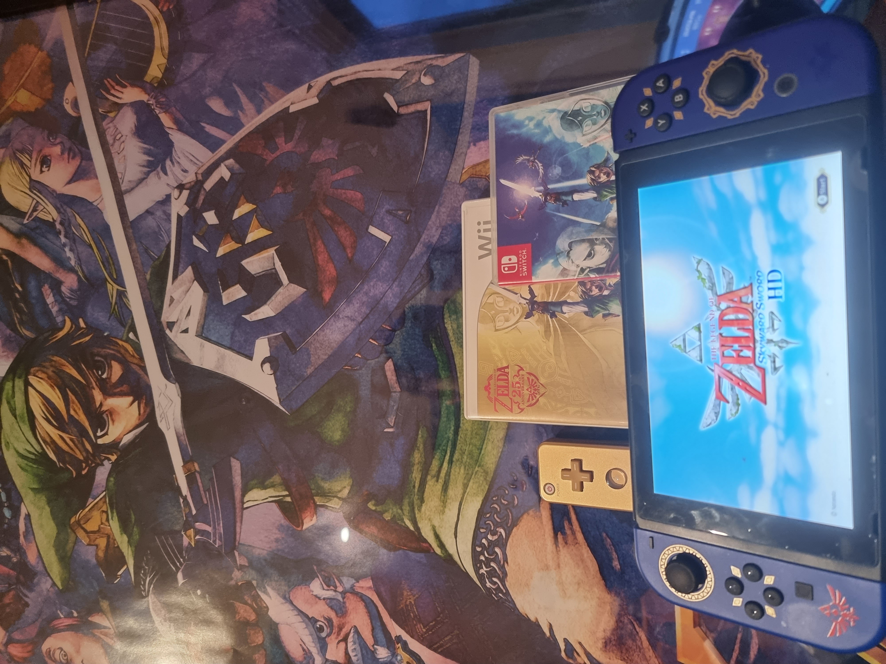
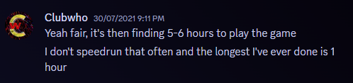
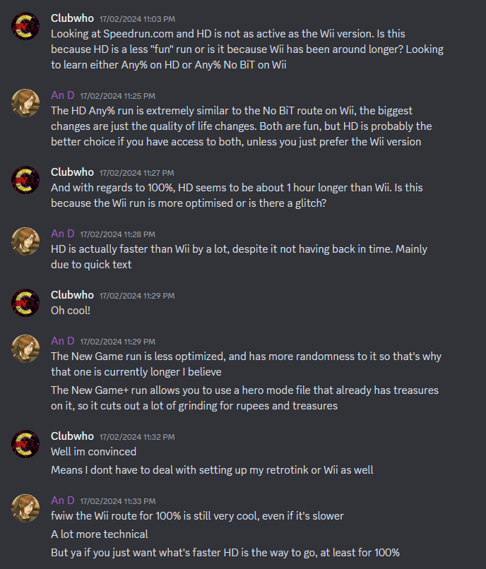
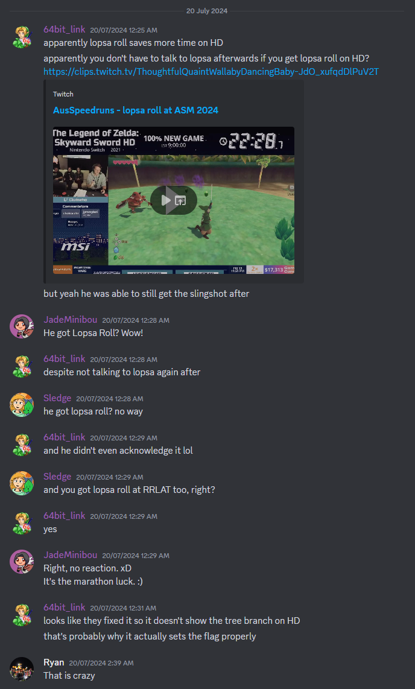
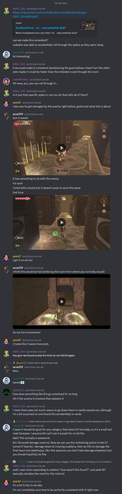
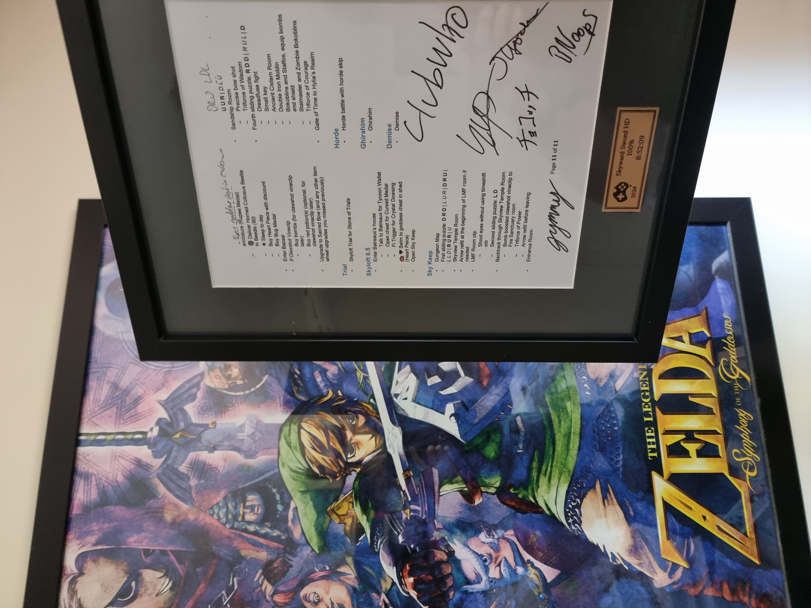

import YouTube from '../../components/blog/common/YouTube.astro'

I speedran The Legend of Zelda: Skyward Sword HD 100% New Game (w/ Amiibo, Hero Mode) in 8 hours, 52 minutes and 9 seconds at the Australian Speedrun Marathon 2024.

<YouTube videoId="pwS8Ppj5R7s" />

9 hours doesn't feel like a speedrun but my god there's so much that happens in the game that there is literally no downtime what so ever.

Now I should say, there are many many people who do long speedruns on the regular and have been doing so for decades, but this is just my experience doing a long speedrun.

## Why?

Great question. Why would I torment myself to playing a game for 9 hours long, start to finish, collecting every item and completing every sidequest.

BUT, you see, I also have to practice the run, and those will be slower than 9 hours. I then have to do it enough times to really get to know the run. So... I am essentially automatically forfeiting like 100+ hours at a minimum. Just to run a game, most likely, overnight, at an event I already put in hundreds of hours for... why the fuck am I doing this?

Why? It was because I loved our graveyard shift runners at ASM.

### Graveyard

When I started to learn more about how speedrun marathons worked I was amazed at how much work goes on behind the scenes. The majority of said word all happens during the swap over of runs. When one run ends and you have to setup the next run within the schedule.

Not to scare you from doing tech (please [volunteer for us](https://ausspeedruns.com/volunteer)), but there are a few steps involved: You have to find the runner, you have to make sure the runner is ready to go, you have to explain to the runner how they are going to be introduced, you have to get the runner to setup their game, you have to make sure you're getting video, you have to make sure you're getting audio, you have to make sure that you're getting their microphone audio, you then have to do your best to mix said audio, then you have to make sure the game is correctly sized for the layout and crop, etc, etc.

All within 5 or 10 minutes.

There's a lot of stuff that happens in a swap over, and if you have a line-up of games that have estimates of 15-20 minutes then you'll be going at 100% for a while.

That's when the graveyard shift comes in. At 4 in the morning very few people in person at the event are up and everyone is tired, so you need to reduce the amount of people doing work on site by as much as possible. Runner managers don't work on shift and social media doesn't work. Hosts still have to host though :P. So praise the fucking lord for JRPG runners with their glorious 6+ hour games. 6 hours or more for tech doing... well... fuck all. Once a run is going it very rarely has an issue during a run which means that tech can relax and the runners can lock in.

ASM2022 was my first in-person event from all the lockdown online events. I got a full taste of how incredibly thankful I truly am of the graveyard shift runners. The runners, walking in at midnight ready to speedrun for the next who knows how many hours. The respect I have for them to sit in an empty room (since everyone attending has gone to sleep) and just commentate for the next 6 hours is crazy. It was then I started to formulate an idea of running my own graveyard shift.

I knew just what game it would be as well.

The Legend of Zelda: Skyward Sword HD.

I knew the speedruns for the game was a decent amount of time so it was a good candidate but I wanted to spend the whatever number of hours to essentially give a university lecture about the Zelda story and universe since I love the Zelda series and world so much. Did I plan for that to happen? Yes. Did it happen? Not in the slightest lol.

### But why Skyward Sword HD?

A quick and weird detour about child Ewan.

I loved Minecraft YouTuber's in 2010 and followed a few closely as any young lad in that time would. In particular my favourite was InTheLittleWood, though I can't remember why he was my favourite all I can remember is that I never missed a video. It was then 4 days after the game released when he first uploaded his let's play of it. [Zelda Skyward Sword: The First Ostrobo! (EP01)](https://www.youtube.com/watch?v=mdY7GYWChHU). I had played a bit of Ocarina of Time on my cousin's N64 but that was really the only Zelda I had consumed, I loved that game even though I could only beat the first dungeon and meet Zelda. Watching Martyn play this game was fantastic, I'm not gonna rewatch the whole series but in particular the voices he gave characters was fantastic, I even [redid one of them during my run as a homage](https://youtu.be/pwS8Ppj5R7s?t=2670) (but you can't hear it because of everyone else disgusted with the lick of the lips).

I never got the chance to actually play the game as I did not have a Wii (still annoyed at my parents about this, when we went to other family and friends houses that had Wiis I would play it the whole time. This was finally rectified at the start of 2024 by buying a Wii and games from my co-worker who actually worked on a few Wii games. Thanks Andy!). Never the less, watching Martyn's let's play firmly set the game into my mind as my favourite Zelda game, even though I had never played it. **It was the story, art style, music, just everything that made me love it and the thought of actually swinging your arm and having it match Link's movement I thought was the coolest thing ever**, something that can only be rivalled by VR gameplay nowadays.

In 2016 I "borrowed" (still haven't given it back, sorry Will) my mates Wiimote and I bought a Bluetooth receiver and sensor bar on my way home. Probably the last sensor bar JB Hi-Fi ever sold. I booted up Dolphin and was super excited to play my favourite Zelda game for the first time. Unfortunately I didn't get far because I was more focussed on playing Counter-Strike with my mates and the game didn't hook me like it used to. (Country-Strike still has a fucking grip on me)

I tried to pick it up a few more times but later there were rumblings of a HD remaster in the works, so I decided to wait things out.

When I got some more money I even bought Skyward Sword on the Wii along with the golden Wiimote. Still didn't have a Wii.

Lost my mind when it was finally announced.

It took 4 days for me to finish (ASM2021 was happening as well at the same time so I couldn't dedicate 100% of my time ok). I do remember once I finished it I searched up the speedrun and found that the digital version was faster, I had the physical version and bought the game on the digital store. I remember pressing buy and saying that I've dedicated myself to speedrun the game.

Here's me even asking questions in the Skyward Sword speedrun discord.

I didn't do shit for years.

### What changed in 2024?

In essence, I got to know syo more and watched Dact learn Final Fantasy games.

I had known syo for a while, first meeting at ASM2022 (I have a distinct memory of leaving the event at midnight when chokocchi was running FF X-2 and thinking how cool syo's and chokocchi's dynamic was, helps that they're siblings). I was (and still am) fascinated how someone goes from being a professional Street Fighter player which is all about fast reactions and frame perfect uber competitive gameplay, to a Final Fantasy runner which takes long hours and more turn based combat.

Around 2023 is also when Dact (Dactyly online) started speedrunning Final Fantasy X-2 and then soon Final Fantasy 9. I was amazed watching my friend who I knew as only a Spyro runner, move to such a different and long game. I talked to him about it when we caught up once and he explained how he does the long runs. He told me he would practice on weekdays, bit by bit, chapter by chapter, and then on weekends do full runs. He mentioned that since you would practice the sections during the week, every weekend was essentially a PB.

It was simple and obvious but breaking down a 9 hour run into 5 almost 2 hour segments was much more reasonable than sitting down for an entire day learning a run.

With basically someone telling me "Hey, you don't have to do the whole thing in one go to start with", I began my journey.

I was going to submit Skyward Sword to ASM2024.

## Prep

### Wii or HD?

I first asked in the Skyward Sword Speedrunning Discord server if I should run Wii or HD. I had noticed that the HD leaderboards seemed wayyy quieter than the Wii leaderboards and wondered if that was for a reason. I then learned the runs were pretty different as Wii has Back in Time (**link to Gymnast video on topic**) while HD was much more "Glitchless". BiT was pretty daunting so I didn't want to do those runs so it was either Any% HD, Any% No BiT Wii or 100%.

HD faster?? I'm sold. As I say in the message also means I don't have to setup my Retrotink or Wii. Just pop my Switch in and go. (Also 60 FPS is a massive win in my books.)

### The First Run

My first run was a Time Attack run, spanning 7 days. I would spend a few hours after work each day chipping away at it. I had my timer, notes and WR at the time on one screen, game on the other, and would play the WR video for 5 minutes, pause, then play that 5 minutes segment. It took me ages and some of the strats I would NOT recommend as a first go, but trial by fire I guess. In the end, I had started, and I was gaming.

It didn't help that Entrance Animation Transfer is one of the weirdest glitches I have seen which involves a little venture back to the save menu. In my first attempt I accidentally loaded my normal save and not my autosave. In the run since you make no save the game will exit you to the autosave save slot, while if you load from a save it will take you to the save save slot. In the video I watched the runner immediately select load game once they reached the main menu, I did the same but instead of taking me to the Ancient Cistern, it took me ALL the way back to the end of the Lanayru Mining Facility. This was at the end of my day as well so I essentially lost a whole day. BUT I PERSERVERED. Just saw it as an opportunity to learn the bit between LMF and AC again. *I wasn't coping don't know what you're talking about.*

The next big challenge was the Boss Rush. I think it took me an entire hour (or more can't exactly remember) to complete. Just fighting boss after boss and trying to keep my hearts and still to this day, the bit of the run I dread the most (and maybe Fun Fun Island WHICH IS NOT FUN FUN AT ALL).

The run ended with me doing it in "15 hours and 13 minutes". I use quotes because I think it should've been a lot longer as I would forget to start the timer a bunch of times and would just let it run when I watched the WR run. So it's more of an extremely generous lower bound.

But time to go from 15 hours TA to hopefully a lot less RTA.

### The First RTA Run

*(Seeing RTA is so funny to me because in my mind it's pretty archaic and stems from a time with Speed Demos Archive and such but that's just me)*

My first RTA run was on the 7th of April 2024, 104 days before ASM, 21 days before ASM submissions and boy was I scared. Strapping myself in for who knows how long and trying to finish the run. No idea how it was going to go. I got up earlier than I usually do on weekends to make sure I had enough time to walk my dog and be done before dinner. Fortunately I wake up at 7 AM for work normally so it shouldn't affect me *too* much. Also trying to explain to my parents that I was not to be disturbed the whole day was tough, normally they can ask me to do something and I'll be down within 5 minutes but this time I had to lock in.

I fortunately have the video of the run but can't remember much of it. Seeing myself with a beard is weird as well.

<YouTube videoId="ZkX9Kr3ydY4" />

What I do remember is feeling like I was going insane when I was finally at Demise, the final boss. My heart rate was so fucking high and I was so relieved to finally finish the game.

The run ended at 10 hours 14 minutes 48 seconds and a heartrate of 149 BPM.

I can do this.

### Submission

ASM2024 submissions closed at the end of DreamHack which was the 28th of April. I had essentially 4 weeks to get my time under 9 hours since I decided I wasn't going to be good enough to get an 8 hour time and 9 felt about right.

What didn't help was that I also had to do the graphics and prep for the DreamHack event, so I had even less time. Basically dedicating myself to do DreamHack work during the week and Skyward Sword on the weekend.

What also didn't help was that I had a life that I also needed to take care of, like family commitments. I really needed to maximise every second I had during this time if I were to get a submission for ASM ready in time. I remember being in the car to a country town for a cousin's engagement party and comparing my only RTA 10 hour time to the current WR time to see where the biggest differences were so I could maximise my improvements.

Between my first run and submission deadline I was actually only able to complete 1 more full run. I had another attempty but my internet died and it threw me off. The time I ended up submitting was a 9:13:27.

I submitted the run that night with a 9 hour estimate, I talked to the coordinator about it beforehand since it's a big nono to submit a run with an estimate lower than the video you provide. However that run I had taken a whole 30 minutes off the run and thought I was in the mode of massive improvement so another 13 minutes is easy... right?

So I submitted and waited and when the schedule came out was both happy and honestly terrified to see it on the schedule.

The reason I was scared was that I had gotten my feet wet with the game and honestly was quite happy that I had completed **A** run of the game. Sure it wasn't the best time by any means but I think the real goal in my head was just to complete a long speedrun. I was already quite satisfied, but now I have an obligation to run the game. I was scared.

### Sunday Service

I decided that every Sunday from then on I would do a Skyward Sword HD run. This was actually the same day a few of my friends would also do their speedruns, notably syo. He would be in my chat often encouraging me and chatting with me, this confused me since I knew he was also streaming and even speedrunning. How tf can you be focussed on words coming out of my mouth, type a response in chat AND then continue speedrunning on your own stream. Turns out Final Fantasy games have cutscenes, some of them quite long. He then suggested we get on a call and just talk to each other. Pretty quickly we decided to do the same thing the next week and immediately syo gave it the hallowed name of... the Sunday Service.

Saiyanz (Salyanz on twitch) was added as well as he is a Kingdom Hearts runner which is 5 hour long game. Dact was then added as well and we would all hang out, chat and keep each other engaged during the day. There were guests as well with Kenorah, chokocchi, Raikou and stylonide joining us.

This was actually one of the most useful things I have done and probably was the reason why my main run had such banging commentary. It forced me to push the game into muscle memory so instead of it taking up my whole focus, I could talk and just do a run.

When I first did my runs I remember someone joining chat and asking me some questions. This threw me off completely to the point where I had to apologise and say I wasn't going to answer any more questions since I needed to focus on the game. Now with the Sunday Service, I was really forced to make sure I knew the game while being able to talk still.

It also let me get to know my friends more which is a benefit I guess... :) \<3

Having the Sunday Service made running my game go from a chore, to an actual exciting task to look forward to because every week we got up to some silly antics and silly conversations.

It was sad saying good bye on the last sunday service, it was a short period of time but I loved every second of it (except when I got really tilted and syo had to calm me down and encourage me to continue, which muted/deafened myself for like 2 hours before coming back).

### Notes

Of course the whole time I was running the game I had the spreadsheet of notes up! But I really didn't want to bring my laptop with me and scroll down the page. I also wanted the ability to make quick additions or notes if I needed to edit them before the run. The solution? Print the fucking notes.

I printed the notes out 4 weeks before the event so I could use them during my practice runs because I didn't want to do my run in person with new stuff to find out I had made a mistake.

I had already moved the notes from the public spreadsheet into my own [markdown format](../../assets/blog/9-hour-speedrun/Skyward%20Sword%20100%25.md) in preparation for this. So all I had to do was convert my markdown into a printable format. I chose word for this which was harder than I thought but I got it in eventually. My first iteration of my printed notes was rough, it was getting late on a Saturday night before one of the practice runs on Sunday and I just printed off what I had. Here's a tip, 19 pages of single sided single column dot points is a bit of a waste of paper.

My next iteration was then also done late on a Saturday night where I made the notes double sided and also compressed it to 2 columns. This brought the number of pages from 19 to 6.

[Skyward Sword 100% Printed Notes](../../assets/blog/9-hour-speedrun/skyward_sword_print2.docx)

syo thought these were super funny and cool while to me they were just my notes for the run.

### ASM2024 around the corner

But as time ticked on, ASM came closer and closer. I also decided to do the most intense graphics work I had ever done at an event too, so my life during June was Work, AusSpeedruns graphics, Skyward Sword runs. Just on repeat. I stopped being on calls with friends at night, stopped playing Counter-Strike with my friends, stopped playing any other game except the 20 minutes I got on the train in the morning. My whole life became about the event.

## The Run

ASM2024 started and though there were a few technical hiccups, it was all pretty minor cosmetic stuff and I could fix it.

### Sleep Prep

The Skyward Sword run was slated to start at 12:15 AM and run until 9:15 AM. Unsurprisingly, I normally go to bed at 11 PM and wake at 8 PM. I had to completely flip my sleep schedule within a week.

I decided that the best way to flip my schedule was to go to bed later and later and later each day. I scheduled my sleep schedule to also account for my tech shifts.

The previous few days I had forced myself to stay up until 2 AM, helped that I was still finishing the graphics so those extra hours really helped. The first day of the event was tough though. Getting up at 7 AM to finish setting up ASM for it's 8:30 AM start and then staying up until a minimum of 3 AM. The next day I stayed up until 7 AM (which I don't even remember tbh). The day before my run though I needed to stay up until 10 AM. Though my run finished at 9 AM the day after, I wanted to account for any sort of elasticity in my sleep schedule. My body would be doing its best to pull my sleep schedule back to normal so if I pushed it just a bit further, I might be more awake at 9 AM.

What really didn't help is how confused my body was trying to go to sleep in the day time and also the amount of stress I was under for the event. I really didn't get any good sleep that week, and any sleep I did get was quite short. I was getting pretty worried about how I was going to stay awake for the run.

Fortunately that night was the Final Fantasy 9 Relay run with syo, chokocchi, Dact and Kenorah. Watching them was good fun and even though I still have 0 idea what's happening in that game. With the event in full swing though, my stress decided to switch from event stress to run stress. Had to start practising.

### Practice

While most runners could spend a few hours before their run, practising the whole thing. I could not do the whole thing in one go. I was planning on spending time throughout the week doing bits and pieces but that never panned out with going to the pub with my mates and the stress of the event itself.

The only practice I got was a few hours during the FF run and a bit before my actual run. Fortunately I chose to speedrun a Switch game so I could just use my Switch in the event room to practice. The only downside was that since it's a motion control game, I had to place the Switch down somewhere and actually move my arms and hands.

I also had a save at the start of the final dungeon, so I was actually able to practice vineclip, horde and the final boss a little. Thanks past me! During that time I also created a save at the end of the game in the event I start going overtime and just need to end the run. Might as well end it at the end of the game rather than some random point in the middle.

If I remember correctly I only got to finish the Ancient Cistern before it was showtime.

### Hyping myself up

To stay awake I knew I was going to have to get excited. I love a good pop-off, give me no restrictions on how loud I can be and I will quickly find the limit. In the weeks my parents have been away and I have the house to myself, I do the biggest fucking pop-offs.

I see it as ripping a band aid off. Just gotta sum up all the courage, go monkey mode and fucking do it. That's why at the start of the run we are so hyped. I was really getting myself going. The run itself, is gonna be a massive band aid to rip off.

### Go Mode

And off we go! The past few weeks and days I had tried to somewhat practice what I was gonna say since the start of the run has a lot of cutscene skipping so if someone didn't know the game they'd have no idea what was happening.

Unfortunately for me, I pretty much forgot all of the games story other than: Zelda falls to the ground, Link searches for her, Zelda seals herself, Link saves Zelda. Which for a 9 hour run, might not be enough story to go off of.

### Lopsa Roll

So in the section where you have to find all the Kikwi's, you have to knock down the Kikwi, Lopsa, from a tree. Normally the sequence is: Defeat Bokoblin's => Lopsa Conversation => Knock Lopsa down from tree => Lopsa Conversation => Vine Swing to next section. However if you bonk into the tree on the *frame* before Lopsa does their first conversation, you immediately knock Lopsa out of the tree and skip a conversation. This skip is extremely hard and pointless as you have to talk to Lopsa again to trigger the flag that signifies you've rescued Lopsa. It more exists in the community as a meme/joke/blessing of a run if you get it.

In Skyward Sword HD the game runs at twice the speed as the original so it's even harder to do it there.

Anyway here's me doing it in the marathon.

<YouTube videoId="pwS8Ppj5R7s" timestamp='1360' />

Did you see my massive pop off? No?

Well that's because I didn't know it existed. It was only after the run when I saw some people in the Skyward Sword speedrunning discord talk about it.

I was also in autopilot so my brain saw that Lopsa had fallen and I just kept going. **Not speaking to Lopsa a second time.** Turns out... you don't need to. Lopsa Roll saves time in Skyward Sword HD. A new timeskip discovered in a marathon run!

### THE LUMPY PUMPKINNNNNNNNNNNNNNNNNNNNNNNNNNNNNNNNNNNNNNNNNNNNNNNNNNNNNNNNNNNNNNNNNNNNNNNNNNNNNNNNNNNNNN

During the last Sunday Service I said a location of the game called "The Lumpy Pumpkin" in a funny voice. To me The Lumpy Pumpkin is my favourite part of the game, the characters are nice, the minigames are fun, the music is great and it's just good vibes overall. The moments I spend in The Lumpy Pumpkin are like checkpoints in the run for me, a reminder of how many dungeons I have completed.

Turns out that funny voice I gave for The Lumpy Pumpkin, set something off in syo and he thought it was hilarious. For the rest of that run whenever I would talk about The Lumpy Pumpkin we always made it a bit. Since that was the last run I would be doing before the real run we both knew we were gonna make it a bit live.

Fortunately the rest of the couch was fully aware of what was going to happen so when I defeated The Imprisoned for the first time, the next step was to visit The Lumpy Pumpkin, we were ready.

<YouTube videoId="pwS8Ppj5R7s" timestamp='8299' />

I think our reaction speaks for itself. I think the call and response thing was so funny as well.

The previous day though syo came up with a cunning plan. On the 2nd last time we go to The Lumpy Pumpkin, we pretend it's the last time, and then lose our fucking minds when we go back.

<YouTube videoId="pwS8Ppj5R7s" timestamp="22072" />

I don't even remember syo screaming.

Though at the end of the run to me, The Lumpy Pumpkin had run its course, to everyone else at the event, it was just getting started. The rest of the event was people pointing out The Lumpy Pumpkin or asking about Pumpkin themed establishments.

To be fair it didn't help that we named the restaurant in the PlateUp! run "The Lumpy Pumpkin" and that whenever there was mention of The Lumpy Pumpkin I would try and scream it from the top of my voice.

One of the things I wanted during the credits of the event was music. Previous years it's just us clapping for 2 minutes and is very boring to me. I asked my friends for some music options but never ended up implementing them. During the 2nd last run of the event I had a glorious idea. Play The Lumpy Pumpkin Kina minigame music. I got the event coordinators blessing and went to work implementing it. Thank god I my laptop is a beast and I can quickly download, edit and convert the audio in a matter of minutes rather than stressing about charging my laptop and waiting for things to load.

Unfortunately there was an issue with the audio in the venue, what happened, idk, I wasn't on tech for that part but thankfully they fixed it for the very last part of the music which is when all the instruments kick in and is the climax of the song. I stood at the front of the venue and did the arm waves, trying to remember the timing of the waves which I actually got but I think not many people understood what was going on which was fun.

### Hindley Skip

During the Lanaryu Mining Facility dungeon, after you collect the Gust Bellows you need to do a deathwarp. *(Sidenote: In the run I called the Gust Bellows the "Gasbag", making fun of the fact of how much we were talking shit, in reality, I forgot the name)*
Normally you can use bombs to deathwarp or use the spikes that appear in the ground (the ground is a maze of sorts). I choose the spikes method since I prefer not to "waste" my bombs since I'm not good at tracking how many I have and how many I will need coming up.

Well I went to roll into a spike and look what happened.

<YouTube videoId="pwS8Ppj5R7s" timestamp='6561' />

Ok you can see by my reaction I knew something was amiss. I just rolled through the spikes, weird. Ah well let's just continue GAMING and complete this deathwarp.

Fast forward a few hours and we suddenly get a donation from none other than 64bit_Link.

<YouTube videoId="pwS8Ppj5R7s" timestamp='13698' />

> Speaking of timeskips, we looked into the weird skip in LMF and found that what you did saves 8 seconds

WHAT THE FUCK. WHAT THE FUCK.

WHAT THE FUCK.

It honestly is incredible that not only I found a skip in a 12 year old Zelda game, but it was found DURING A MARATHON.

It only saves 8 seconds in a very specific run, but nonetheless, crazy that I "helped" somewhat in the community.

Though I am not in control of naming glitches (no one is, it's just whatever the community decides to call the skip), it would be nice to call it Hindley skip. Hindley is the street the event was taking place at, and it also so happens to be the only area of nightlife in Adelaide, which means the usual business. Just try Googling "Hindley Street news" and it shouldn't take long. Now in the glitch you skip spikes which means you skip getting stabbed, therefore if you were to skip getting stabbed you could name it after a street where the chances of being stabbed are higher than usual, something like Hindley Skip.

### Toilet Break

So I had only ever done one run before with no toilet breaks, every other run I did one or two. The problem is that there is no downtime in the game to *have* a toilet break without standing still for a period of time. There's really only two sections in the run, a cutscene 2 hours in and anytime you defeat the Imprisoned (which happens a few times in the run). Even then, the skips only minimise the amount of time spent standing still, it's just the longest cutscene. I joked to my friends about wearing a diaper and going during the run.

During the event as well, since I was so incredibly stressed my body had decided that anything in it, was to be accelerated out as soon as possible. Which I was not looking forward to during my run. Fortunately for me (and everyone else), my body decided to behave.

But I decided to force a toilet break regardless, I decided I would go at my usual time of the 2 hours in cutscene which is the cutscene after you defeat Moldarach. The cutscene takes a while as it goes over the boss dieing, the sand taking it's sweet sweet time to drain, then the heart container appearing. Then there is a small section where you have to activate a time crystal and hop in a minecart which also takes a while.

Great! I just have to teach someone on the couch how to use the hook beetle to hit the time crystal and then I get like 2 minute window to go to the bathroom.

Anyway, I am only a few hits away from defeating Moldarach when I realise, I haven't taught anyone what to do. I quickly try my best to teach Syo what to do but then the couch is telling me to go to the bathroom now. I fucking leg it to the bathroom and piss as hard as I can. Unbeknownst to me, absolute confusion is happening in the stream room.

<YouTube videoId="pwS8Ppj5R7s" timestamp='7482' />

I'll be honest, walking back into the room and watching Syo slashing the minecart really did have me confused.

### Mine cart Ride

One of my favourite parts of the game is the mine cart rollercoaster. I remember doing my first casual playthrough of the game and wanting to learn the speedrun *just* so I could get to this part fast.

In the mine cart section, you have to lean into the corners to gain speed, so why the fuck don't we also do it in real life.

<YouTube videoId="pwS8Ppj5R7s" timestamp='13330' />

Oh yeah, and we have to do it twice.

<YouTube videoId="pwS8Ppj5R7s" timestamp='13610' />

It was only after the run when I saw clips of it and realised that what Kenorah and Dillon had been doing at the camera was to *also* move the camera in accordance to the moves. (Yes we technically are moving in the opposite direction but it was correct to us ok.)

Massive shoutout to Kenorah and Dillon for having the quick thinking of even moving the camera (and jumping it?!) during the run.

### A Northbound Sabre

Alright before this chapter you need to watch this video.

<YouTube videoId="luB9PeSVCCA" />

So the couch started to make these jokes in the run.

<YouTube videoId="pwS8Ppj5R7s" timestamp='18580' />

I was so focussed on the run it wasn't clicking what they were saying. To me everyone on the couch was putting on a funny voice and saying something in a funny way. I was having a good time so was just chuckling along the way. It took me so long until I realised what they were doing.

<YouTube videoId="pwS8Ppj5R7s" timestamp='18780' />

God I lost my mind and thought I was so dumb. I didn't even make note of the fact that link was about to faceplant and slide down on his face, something that brings out a smile in me.

### Fun Fun Island

It is not Fun Fun, the man is a LIAR.

Anyway, this island can absolutely grip me if I am not careful and make me waste so much fucking time. The pop off I do here is actually legit, I was so happy that I did it in the first few tries.

<YouTube videoId="pwS8Ppj5R7s" timestamp='28574' />

### Vine Skip

The one skip I really REALLY wanted to pull off was Vine Skip. It's a really hard (~7 frame, 60 fps game = 0.117s) trick which saves about 4 minutes or so. It skips a whole auto scrolling section by using a bomb explosion to push yourself through a wall while using the hookshot to very slightly clip yourself into the wall. It is easily the hardest skip in the game, and it would be really REALLY cool to pull it off in a marathon run.

<YouTube videoId="pwS8Ppj5R7s" timestamp='30570' />

### The End

I'll be honest. I can't believe I made it to the end. Almost 9 hours of being extremely tired, 9 hours of banter and of course 9 hours of GAMING. I was doing the Horde battle. I was trying to explain what I was doing in the fight and keep the commentary up when it hit me. After this there is a 90 second boss, and then a 40 second boss. I was really fucking close to the end and I hadn't started doing the wrap up.

I really dislike when runners do their thanks and such *after* they finish the game, because they start eating into the next setup time (unless they are well below estimate, then I don't give a shit). Runners also tend to go on and on and on, unsure on when to stop. A key skill I got told to by someone who has done a lot of FGC commentary is the ability to stop on a hard stop and not just keep talking until they run out of things to say. Which meant I better start talking.

I never prepared anything to say, all I remembered was to thank 2 people. Syo and 64bit_Link. In hindsight I probably should've written something down, to express how much their help and generosity with their time and attention meant to me. Instead, I just said the first things that came to my mind, a tired, 9 hour speedrun, mind. Which in hindsight, might be more true to the heart.

We got a little bit in trouble as well since I popped off at breakfast time. I just remember at the very end a person from the hotel slowly walking in. Seeing that I knew we were a little bit in trouble. Fortunatley all they asked us to do was to close the outside doors between breakfast and dinner time.

I got to my room, checked discord, sent a few quick messages, and had the best fucking sleep I have had in a long time. So much that I slept through my alarm, ruining my first attempt to try and reset my sleep schedule back to a normal time.

## After thoughts

It's been about a month and a half since I did the run. Most of this post was written one week after but this section and the editing have been a while after. *(And even now at the end of the year lol, this took way too fucking long)*

I look back on the time and actually wonder how the fuck I did it. How the fuck I initially sat down for over 10 hours speedrunning the game. How I then did that for the next few months every Sunday running the game. How I then weaved that in with working on the graphics/going to a wedding/life. How I then helped run a speedrun marathon while also trying to push my sleep schedule back and back and back so I would be conscious during my run. How I then sat down, in the middle of the night and just absolutely went ham GAMING. How I was able to be apart of such an incredible commentary and actually be somewhat active in it. How I then got all these insane pop offs and skips. How I then absolutely nailed my estimate.

It all seems impossible when I write it out like that. But it's all true. I did it all.

When I try to remember my memory of sitting in that chair doing the run, I look back on it as one of the peaks of my life, speedrunning a game that means so much to me, with my best friends having a great time, and raising money for charity, all in the middle of the night.

I've always been amazed by how people can do such long speedruns, so much to remember and so much to execute. But I proved to myself that, I can do it. There wasn't any sort of special sauce, it was just sitting down and getting it done, and then sitting down again, and doing it again.

I liken it to learning the lyrics of a song. We'll take the ABC's as an example. If you asked me to start halfway through, I would really have to sing it in my head until I get to that part, because the previous sequence leads into the next one. That's what this run felt like. I knew what to do next because I just did X in this area which means I have to go to Y in the next.

Even writing this, I did not expect this to become over 6000 words. If you read all this then holy shit you are dedicated. I wrote this more for me to look back on in how many years to come. These words are no where near how important this run was to my heart.

Would I do it again? Hmmmmmmmm... maybe??? More leaning on no though. It just takes so much fucking time out of me. Dedicating an entire day of the week to the game was too much. I have too many other projects I want to work on and too many other games I need to play. What this does open me up to, is the 2–4 hour runs. Those time frames honestly feel like nothing to me now. After doing the 9 hour runs, I feel like I am capable of running anything.

