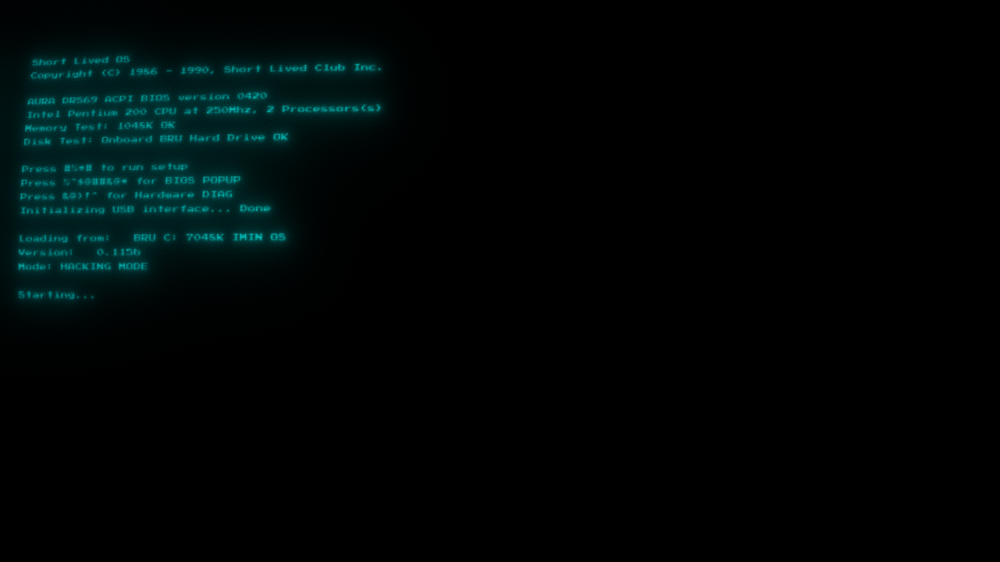
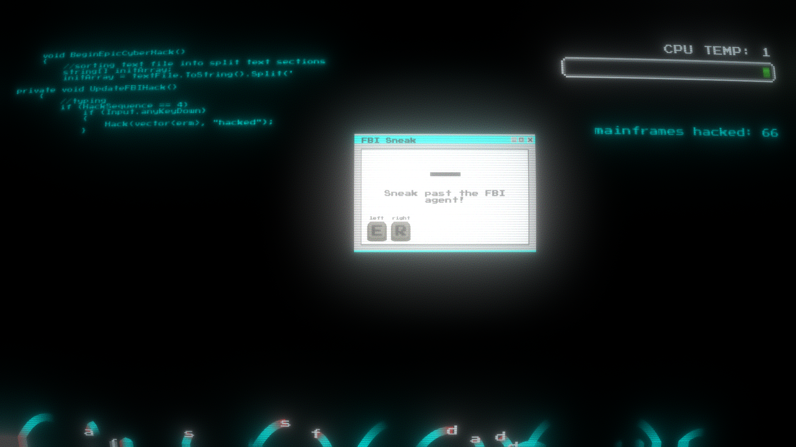
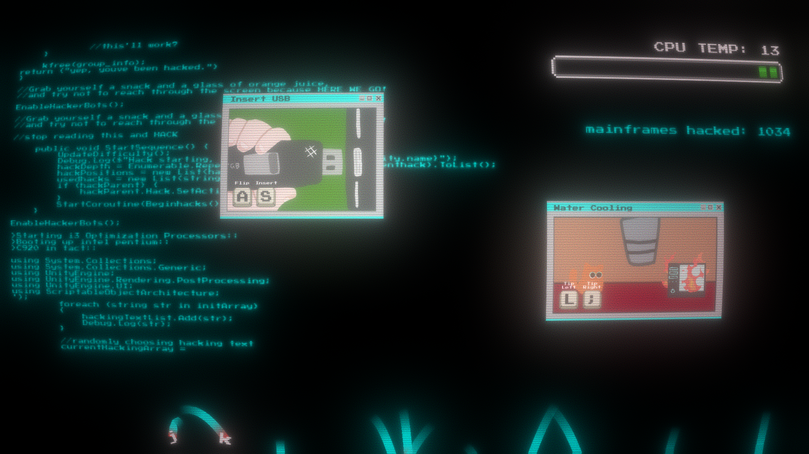
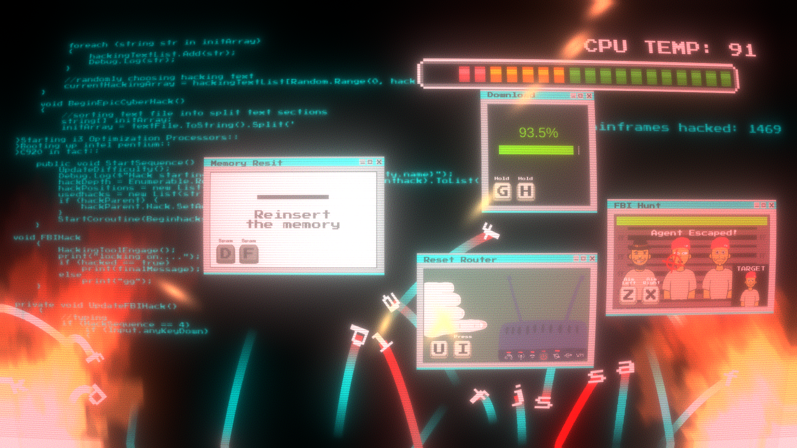

An 80s themed hacking game with micro games. This was the project made for my digital games prototyping unit where we had a single semester to pitch a game idea and develop it.

Custom boot bios startup

I worked in a team of 5 in which I was the lead programmer guiding the 2 other programmers to develop the game.

<!--  -->

The aim of the game was to mash your keyboard to emulate a hacker seen in movies with a [hackertyper](https:/hackertyper.net/) background. There would then be micro games played with only two keys that the player must complete as to not let their CPU overheat and fail.

The games controls used Unity's new input system and heavy use of scriptable objects to allow the dynamic allocation of keybinds for the micro games. The micro games were also developed inside a sandbox to allow the other developers to write the micro game however they saw fit and wouldn't have to worry about how the micro game will get instantiated or destroyed.

